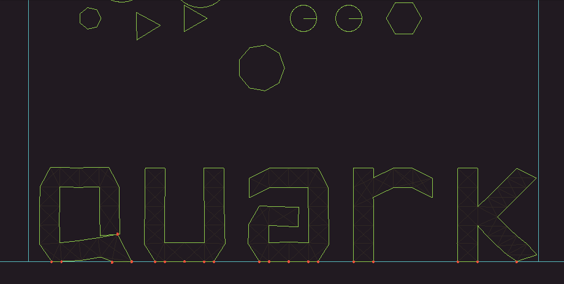

QuarkPhysics is a 2D physics engine designed for games. Its goal is to provide a reasonable approach to simulate rigid bodies, soft bodies, and different physics models together.

[Documentation](https://erayzesen.github.io/QuarkPhysics/documentation/) | [Examples](https://github.com/erayzesen/QuarkPhysics/tree/master/examples)

 ---
 
 

 
 Show Examples

 
 
 
 
 

 

## Features
* General Features
  * Primitive shape types (circle, polygon, rectangle...etc) 
  * Physical properties (mass, area, restitution etc.)
  * The API is designed specifically for 2D video games. 
  * Raycasting
  * Collision layer masks for advanced collision filtering
  * SAP for broadphase
  * Supports sleeping islands to improve CPU performance.
  * Flexible and advanced event system.
  * It uses pixels directly as a unit without any abstractions.
  * Unlimited shape-mesh support for bodies.
  * Simple and consistent API
  * External .qmesh file support. There is also [QMeshEditor](https://github.com/erayzesen/QMeshEditor) app for create/edit/manage qmesh files. 
   
* Rigid bodies
  * Convex polygons support. 
  * Joints to connect bodies
  * Reasonable stability for stacked objects.
  * Kinematic bodies for creating controllable physics objects. 
  * Area bodies for detecting and reporting collisions.

* Soft Bodies
  * Springs to connect particles.
  * Mass-spring model.
  * Area-volume preserving model.
  * Shape matching features.
  * Self collisions.
  * PBD dynamics.
  * Internal springs and internal particles for adding more complexity to soft body simulations.
  * Customizable constraints for adding more control to simulations.
  * Advanced particle methods. 
  
## Building Examples
You need to install [SFML](https://www.sfml-dev.org/) and [CMake](https://cmake.org/) on your system before. 

Download project, enter the main folder and call this;

        ./build.sh -r
Another way is that compiling the project directly via gcc if you're on linux call; 

        ./run_linux_fast.sh -r

## Using
Copy the "QuarkPhysics" named subfolder in the main folder to your project and use it. 

## Third Party 
- [nlohmann's json](https://github.com/nlohmann/json) for the json parsing. (Importing meshes via *.qmesh files)
- [SFML](https://www.sfml-dev.org/) library for window,input,opengl. 
- [Doxygen-Awsome](https://jothepro.github.io/doxygen-awesome-css/) for the custom themed documantation.

## Roadmap
* 1.0
  * API revisions (v0.9x)
  * Optimizations ( v0.9x)
  * Bug fixes 
* 1.1
  * ~~Automatic conversion of concave polygons to convex polygons~~ (added v0.9x)
  * Fluid dynamics
* 1.2
   * UV mapping features to QMesh
   * Destructable rigid bodies.
* 1.3
   * Continuous collision dedection (CCD)
   * Multithreading

